# A-Train

[](https://github.com/Arash-abraham/A-Train/actions/workflows/ci.yml)

<p align="center">
  
</p>

**A high-performance file comparison tool for developers.**

> Named after the fastest member of The Seven — because a diff should arrive before you
> finish blinking.

A-Train compares two files or directory trees, with an emphasis on speed, precision, and
purpose-built comparison modes. The comparison core uses only the Python standard library;
rich terminal output and the interactive TUI are optional extras.

- **Status:** feature-complete through roadmap v0.4 (text / binary / JSON / CSV / tree
  modes, five output formats, interactive TUI, digest cache). See
  [ROADMAP.md](./ROADMAP.md) for the plan and [benchmarks/RESULTS.md](./benchmarks/RESULTS.md)
  for measured performance.

---

## Highlights

- **Fast by design** — hash-based early exit for identical inputs, Myers O(ND) diff over
  pre-hashed integer line ids, linear-space middle-snake refinement, and a wall-clock guard
  that bounds pathological inputs. Measured: 100 MB identical files in **0.34 s**;
  15.6× faster than `difflib` on scattered 5 MB changes.
- **Purpose-built modes** — dedicated engines for text, binary, JSON, CSV, and directory
  trees; no single general-purpose algorithm forced upon all inputs.
- **Correctness first** — every edit script is verified to reconstruct the target exactly
  (property-based round-trips plus golden tests against GNU diffutils, applied with GNU
  `patch`).
- **Developer-friendly output** — patch-compatible unified diffs, colored terminal output,
  side-by-side views, standalone HTML reports, and machine-readable JSON for CI pipelines.
- **Zero hard dependencies** — `pip install textual` only if you want the TUI.

## Installation

```bash
git clone https://github.com/Arash-abraham/A-Train.git
cd A-Train
python -m atrain --help          # no install step needed
pip install -e .                 # or install the `atrain` console script
pip install textual              # optional: interactive TUI
```

Requires Python 3.10+.

## Usage

```bash
# Basic comparison (patch-compatible unified diff)
python -m atrain baseline.txt candidate.txt

# No --mode needed: directories, .json/.csv and binary content are detected
atrain config_v1.json config_v2.json        # → semantic JSON diff
atrain ./release-1.0 ./release-2.0          # → tree diff
atrain firmware_v1.bin firmware_v2.bin      # → hex change regions

# Colored terminal output, ignoring whitespace differences
atrain a.py b.py --format color --ignore-space

# Side-by-side view, HTML report, machine-readable JSON
atrain a.py b.py --format side
atrain a.py b.py --format html -o report.html
atrain old.json new.json --format json > report.json

# Semantic CSV comparison keyed on a column
atrain sales_jan.csv sales_feb.csv --key-col order_id

# Directory trees, parallel with 4 workers, digest cache across runs
atrain ./release-1.0 ./release-2.0 --workers 4 --cache

# Ignore options (GNU diff compatible)
atrain a.txt b.txt --ignore-case --ignore-matching '^#' --strip-trailing-cr

# Watch two files and get a live alert on every change
atrain --watch both service.yaml service.local.yaml

# Interactive TUI (needs `pip install textual` and a real terminal)
atrain a.py b.py --tui

# Git: compare a file against history, or between two revisions
atrain --git HEAD~1 src/app.py
atrain --git v1.0..v2.0 config.json --format side
```

## Tour

Every screenshot below is generated from real runs against the fixtures in
[`docs/demo/`](./docs/demo/) by [`docs/screenshots/make_screenshots.py`](./docs/screenshots/make_screenshots.py)
— rerun it after any change to the formatters and the images stay honest.

### The command line

`atrain --help` — all options at a glance. Exit codes follow GNU diff (`0` same, `1`
different, `2` trouble).

<p align="center">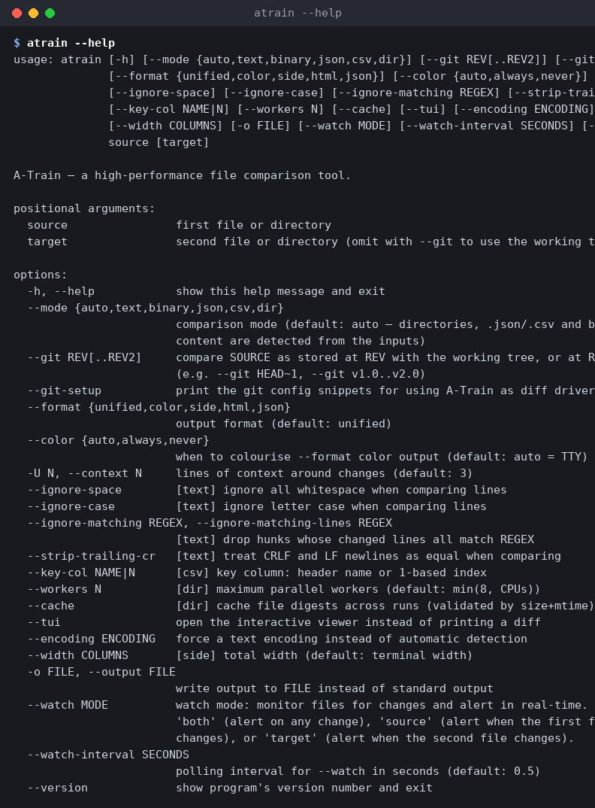</p>

### Text diff, three ways

**Colored output** with dual line numbers and intra-line word highlighting (bold marks the
exact tokens that changed):

<p align="center">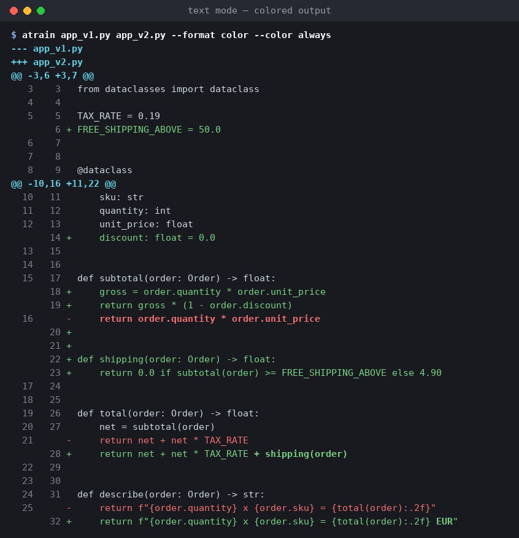</p>

**Unified** — the default; byte-for-byte compatible with `patch -p0` and `git apply`:

<p align="center">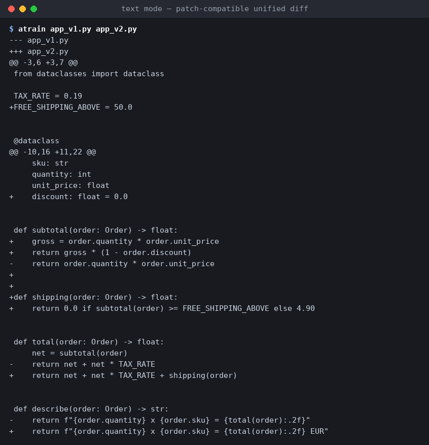</p>

**Side by side** — `--format side`, width follows the terminal or `--width`:

<p align="center">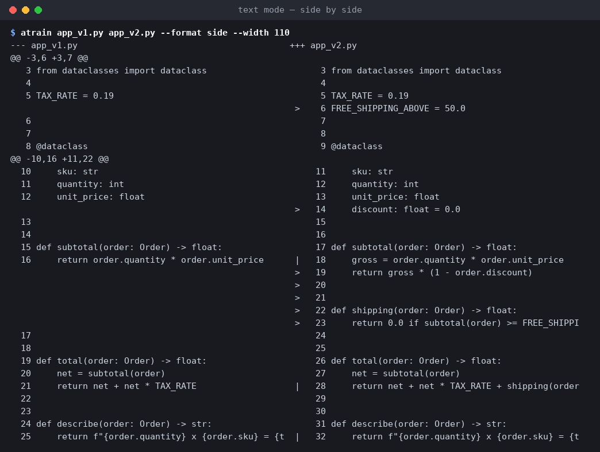</p>

### Auto-detected modes: JSON, CSV, binary

No flags. `.json` files are parsed and compared semantically (key order is irrelevant,
changes are reported as JSONPath), `.csv` rows are matched on `--key-col`, and anything
with NUL bytes gets the hex engine:

<p align="center">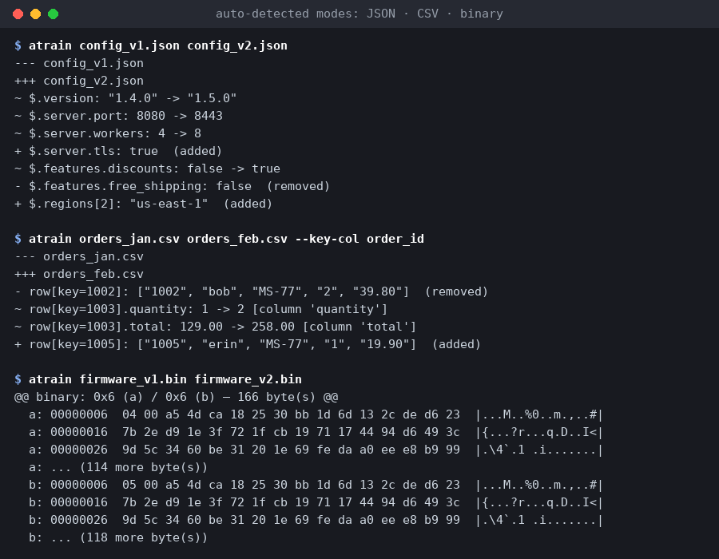</p>

### Directory trees

Added / removed / modified files first, then a per-file diff for every modified pair.
Files are hashed in parallel; `--cache` remembers digests between runs:

<p align="center">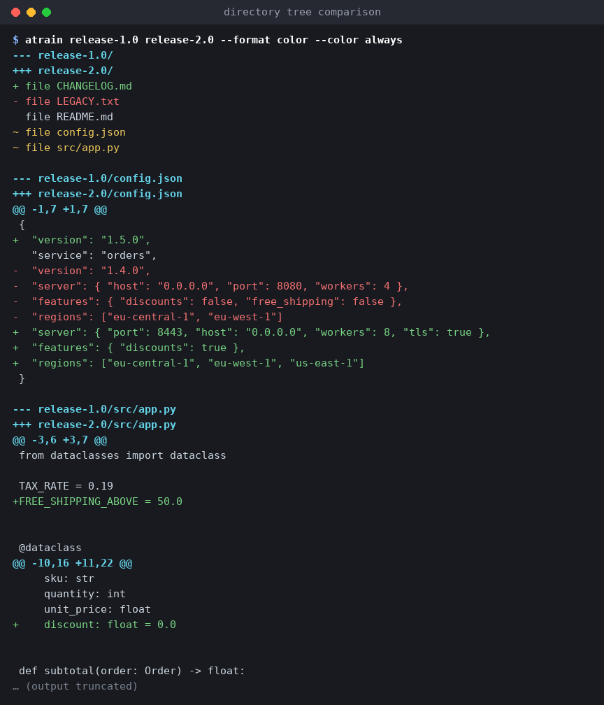</p>

### Ignore options

`--ignore-case`, `--ignore-space`, `--ignore-matching REGEX` and `--strip-trailing-cr`
behave like their GNU diff counterparts — here the same two files go from "different" to
"identical, exit 0":

<p align="center">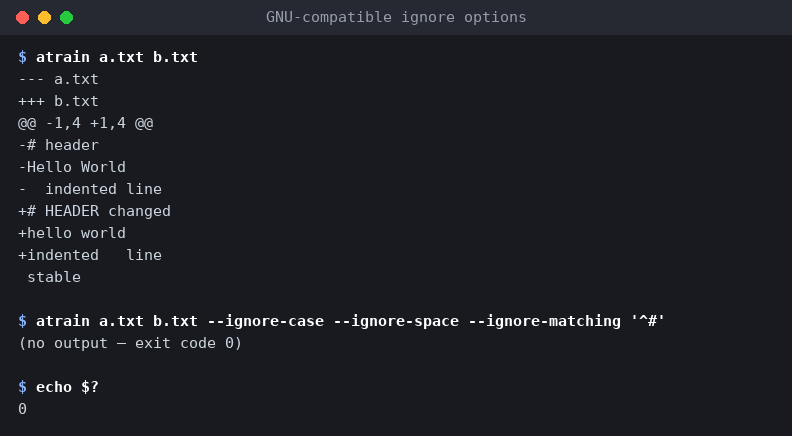</p>

### Git integration

`--git REV PATH` compares a file in history with the working tree; `--git A..B PATH`
compares two revisions. Mode auto-detection still applies — the JSON file below gets a
semantic diff straight out of `git show`:

<p align="center">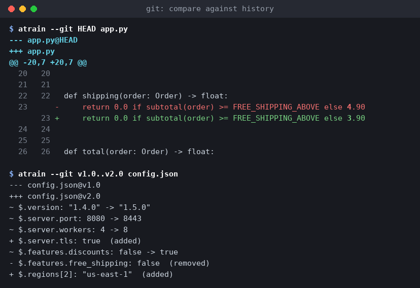</p>

A-Train also speaks Git's external-diff protocol. One config line and every `git diff`
(including `git log -p`, `git show`, …) renders through A-Train:

```bash
git config diff.external atrain                  # or: "atrain --format side"
git difftool -x atrain                           # on demand, no config change
atrain --git-setup                               # prints all the snippets
```

<p align="center">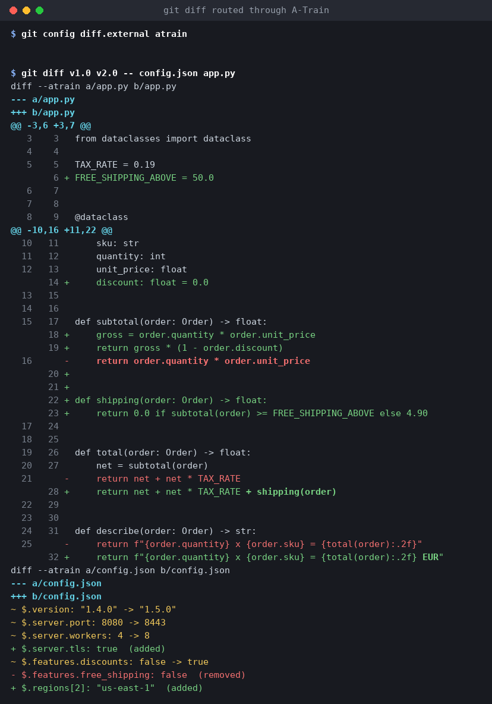</p>

### Watch mode

`--watch both|source|target` polls the two files and prints a timestamped alert with the
delta each time one of them changes — handy while hand-editing generated configs:

<p align="center">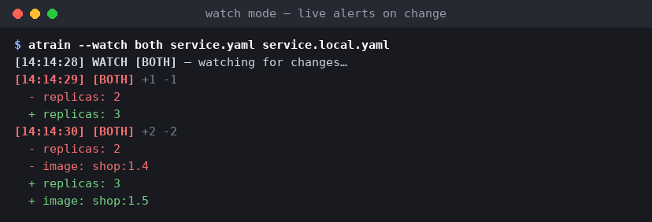</p>

### Interactive TUI

`atrain a b --tui` opens a Textual viewer: synchronized single-stream scrolling,
`n`/`p` jump between hunks, `r` reloads the files, `q` quits.

<p align="center">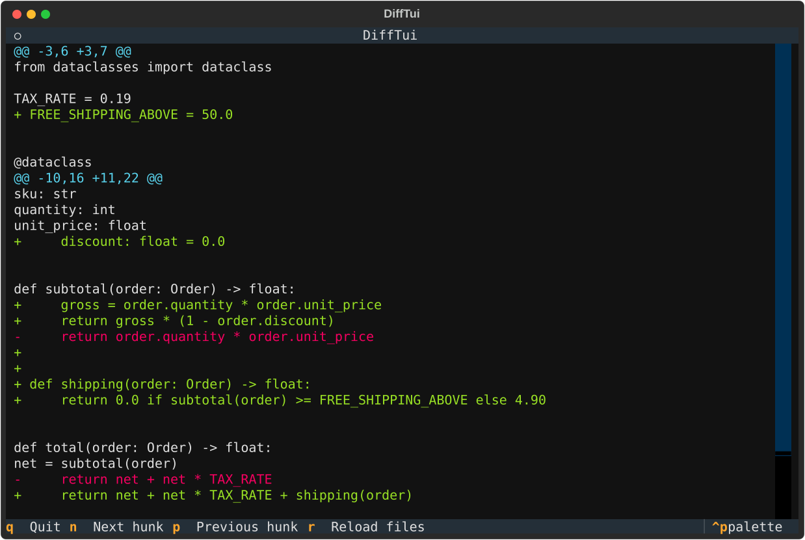</p>

### Machine-readable JSON and HTML reports

`--format json` emits a stable nested document for CI consumption; `--format html` writes a
self-contained report (no external assets) — open
[`docs/demo/report.html`](./docs/demo/report.html) for a sample.

<p align="center">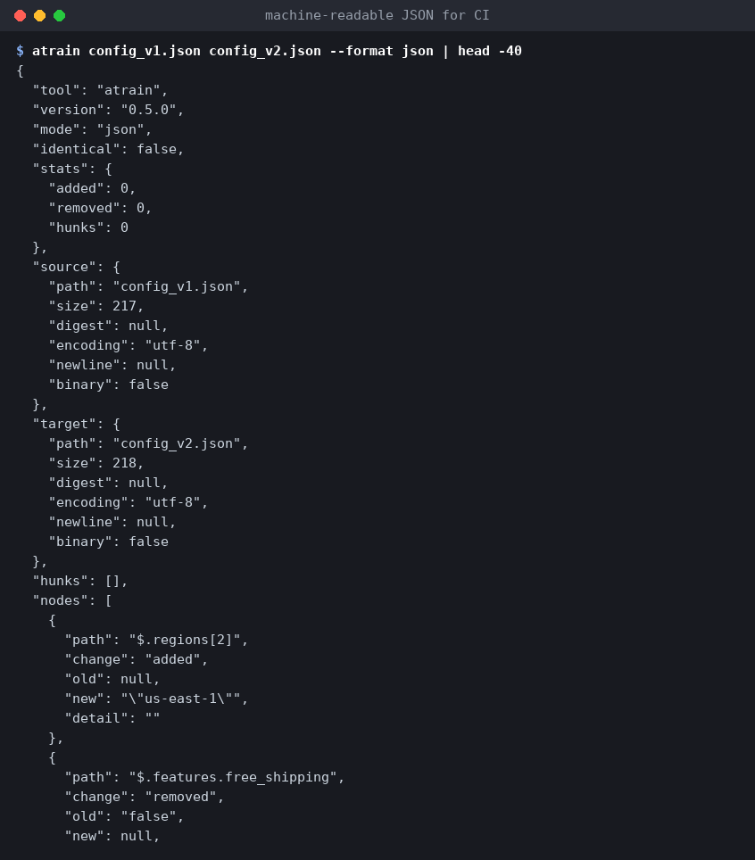</p>

Exit codes: `0` no differences · `1` differences found · `2` error (bad input, malformed
JSON/CSV, unknown key column, …) — CI-friendly.

### Comparison Modes

| Mode | Purpose |
|---|---|
| `text` | Line-based diff with intra-line word-level refinement; whitespace, case, and regex ignore options |
| `binary` | Chunked comparison with rolling-hash change-region detection and hex display |
| `json` | Semantic comparison independent of key order, with JSONPath-style change reporting |
| `csv` | Key-column-aware row comparison: added, removed, and modified records |
| `dir` | Parallelized tree comparison with per-file diffs and per-file error capture |

### Output Formats

| Format | Modes | Notes |
|---|---|---|
| `unified` | all | patch-compatible; the default |
| `color` | all | ANSI colors, `--color auto\|always\|never` |
| `side` | text only | two-column view (`--width` to set total width) |
| `html` | all | standalone report, no external assets |
| `json` | all | nested document; stable for CI consumption |

## Architecture

```
atrain/
├── core/      # Dependency-free engines: reader, hasher, diff_text, diff_binary,
│              # diff_structured (json/csv), diff_tree, cache, models
├── output/    # unified, color, side_by_side, html_report, json_out, hex
├── tui/       # Interactive Textual viewer (optional dependency)
└── cli.py     # Command-line interface + __main__.py entry point
```

The comparison core is deliberately isolated from presentation concerns: results are plain
data classes (`DiffResult`, `Hunk`, `BinaryRegion`, `NodeChange`, `TreeEntry`) consumed
uniformly by any output formatter. Full design rationale and milestone planning are
documented in [ROADMAP.md](./ROADMAP.md), implementation notes (including every bug found
and fixed) in [DEVELOPMENT_REPORT.md](./DEVELOPMENT_REPORT.md), and every test run in
[test/TEST_REPORT.md](./test/TEST_REPORT.md).

## Performance

Measured on this project's hardware (Python 3.11.2, 2 vCPUs, Linux); full methodology,
tables, and the honest misses are in [benchmarks/RESULTS.md](./benchmarks/RESULTS.md):

| scenario | A-Train | difflib | GNU diff |
|---|---:|---:|---:|
| 100 MB identical | **0.338 s** | — | 0.215 s |
| 100 MB, 1 line changed | 3.482 s | — | **0.215 s** |
| 5 MB scattered changes | 0.545 s | 8.520 s | **0.032 s** |
| 5 MB every other line | 2.665 s¹ | timeout (60 s) | **0.032 s** |

¹ bounded by the built-in ~2 s wall-clock guard (v0.4); the fallback diff is coarser but
still reconstructs the target exactly.

## Development

```bash
python -m pytest tests/ -q      # official test suite (incl. hypothesis + golden tests)
python -m ruff check .          # lint
python -m mypy                  # strict type check of atrain/
python3 test/01_project_structure/verify_structure.py
python3 benchmarks/run_benchmarks.py   # ~6 min, writes the RESULTS.md table
```

`test/` contains the exploratory laboratories (one folder per topic, each with its own
README); `tests/` is the official suite. Regression reproducers for every bug fixed during
development live under `test/NN_regression/` style folders.

## Repository Contents

| Path | Description |
|---|---|
| `README.md` | This document |
| `ROADMAP.md` | Authoritative development plan for v2 |
| `DEVELOPMENT_REPORT.md` | Per-issue implementation record |
| `IMPROVEMENT_SUGGESTIONS.md` | Documented, deliberately *unimplemented* ideas |
| `benchmarks/` | Benchmark harness + measured results |
| `tests/` | Official test suite |
| `test/` | Exploratory test labs, profilers, and reports |
| `docs/demo/` | Fixture files used by the README tour |
| `docs/screenshots/` | Screenshot generator (`make_screenshots.py`) |
| `Img/` | Branding assets and generated screenshots |

## Branding

The project takes its name and identity from A-Train, the speedster of *The Boys*.
Branding assets are maintained in [`Img/`](./Img/).

## License

The license for this project will be specified upon its first public release.
